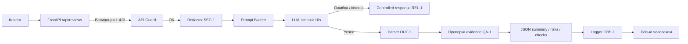

# ADR: решение для первого рабочего сценария

- Статус: proposed
- Дата: 2026-09-11
- Ответственные: команда учебного проекта (студент)

## Контекст

Учебный сервис AI-reviewer получает diff PR и должен возвращать структурированный результат для человека-ревьюера и автоматических проверок.

В `TRAINING_PR.diff` выявлены нарушения правил из `CASE.md`: отсутствуют редакция секретов (SEC-1), ограничение длины diff с ответом HTTP 413 (API-1) и требуемый контракт ответа (OUT-1).

Также `CASE.md` задаёт требования к таймауту внешней LLM и контролируемому ответу (REL-1), подтверждению рисков evidence (QA-1), политике логирования (OBS-1) и области ответственности сервиса (SCOPE-1).

Решение должно соблюдать SCOPE-1: сервис только формирует рекомендации и не совершает действий в репозитории.

## Решение

- Ввести предвходовую валидацию тела запроса и лимит на длину diff: при размере более 20 000 символов возвращать HTTP 413 (API-1).

- Перед формированием prompt редактировать секреты — токены, пароли и приватные ключи — в diff по SEC-1, заменяя значения на маркер `[REDACTED]`.

- Формировать структурированный ответ по OUT-1: `summary`, `risks`, `checks`. В `risks` допускается не более трёх элементов с полями `file`, `line`, `evidence`, `risk`.

- Применять QA-1: включать риск в итоговый ответ только при наличии подтверждения строкой diff или правилом репозитория. Проверка выполняется на стороне сервиса до возврата ответа.

- Для подтверждения по diff `evidence` должен ссылаться на указанную строку по `file`/`line` и содержать цитату или фрагмент из неё. Для подтверждения правилом репозитория `evidence` должен однозначно ссылаться на применимое правило: содержать идентификатор правила из `CASE.md` (например, QA-1, SEC-1, OUT-1).

- Не требовать обязательного побуквенного совпадения `evidence` со строкой diff: QA-1 требует подтверждения риска, но не задаёт конкретный алгоритм текстового сравнения. Элементы, для которых подтверждение не установлено, исключаются из `risks`.

- Оборачивать вызов внешней LLM таймаутом 10 секунд. При таймауте или ошибке возвращать контролируемый ответ по REL-1 вместо необработанной ошибки. Формат и HTTP-статус такого контролируемого ответа текущими требованиями не определены и остаются открытым вопросом. Критерий проверяемости REL-1: при таймауте/ошибке возвращается ответ с HTTP-статусом не из класса 5xx; конкретный код и формат тела — открытые вопросы.

- Применять политику логирования OBS-1: логировать только `request_id`, длительность и статус, не записывая содержимое diff и ответ модели.

## Рассмотренные альтернативы

| Альтернатива | Почему не выбрали сейчас |
|---|---|
| Полагаться только на наличие `evidence`, возвращённого LLM | Не обеспечивает QA-1: модель может сформировать неподтверждённое evidence |
| Требовать побуквенного совпадения `evidence` со строкой diff | Избыточно: `CASE.md` требует подтверждение строкой diff или правилом, но не задаёт алгоритм точного сравнения |
| Использовать эвристическое сопоставление evidence | Сложнее воспроизводимо проверять; повышается риск ошибочно подтвердить неподдержанный риск |
| Чанковать длинные diff вместо HTTP 413 | Не требуется в учебном кейсе; API-1 явно предписывает HTTP 413 |
| Требовать от controlled response формат OUT-1 | Не выбрано: REL-1 требует контролируемый ответ, но источники не определяют его формат; это остаётся открытым вопросом |
| Полностью хранить входы и выходы LLM для аудита | В учебном сценарии не требуется; повышает риск утечки данных и усложняет соблюдение OBS-1. `CASE.md` не устанавливает отдельный запрет на хранение вне логов |

## Последствия и главный риск

### Положительные последствия

- Предсказуемый контракт успешного ответа по OUT-1.
- Снижение риска передачи секретов внешней LLM.
- Контролируемое поведение при деградации внешней LLM.
- Неподтверждённые риски от LLM не попадают в итоговый ответ.
- QA-1 проверяется на стороне сервиса, а не только инструкцией модели.
- Решение не вводит более строгий алгоритм проверки evidence, чем задано `CASE.md`.

### Ограничения

- Diff более 20 000 символов не обслуживается данным сценарием.
- Возможна потеря части контекста из-за редактирования секретов.
- Для QA-1 необходимо сопоставлять `file`/`line` и `evidence` с исходным diff либо с правилом репозитория.
- Формат контролируемого ответа при ошибке или таймауте LLM пока не определён.
- Возможны ложные отрицания при серверной фильтрации evidence по QA-1 (корректный риск может быть исключён).

### Главный риск

Неверная идентификация секретов или избыточная маскировка.

### Как проверим риск

- юнит-тесты на типовые шаблоны секретов;
- code review правил редактирования;
- интеграционные тесты на отсутствие исходных секретов в prompt и логах.

Дополнительно для QA-1 проверяем:

- риск без подтверждённого evidence исключается;
- риск с evidence, не связанным с указанной строкой diff, исключается;
- риск с цитатой или фрагментом указанной строки diff сохраняется;
- риск с однозначной ссылкой на применимое правило репозитория сохраняется.

## Архитектурная схема

## Открытый вопрос

REL-1 требует превращать ошибку внешней LLM в контролируемый ответ, однако `CASE.md` не определяет HTTP-статус и формат тела такого ответа.

Поэтому соответствие controlled response формату OUT-1 не фиксируется как требование до появления дополнительного соглашения.

## Как использовали AI

- Для чего: первоначально зафиксировать архитектурное решение, а затем последовательно проверить и уточнить его в Практике 2.
- Тип промпта: структурированный master prompt в Практике 1; Few-shot, R.C.T.F., Chain of Verification, Tree of Thoughts, RAG и ReAct в Практике 2.
- Журнал Практики 1: [`prompts.md`](prompts.md), P1-02.
- Журнал экспериментов Практики 2: [`../practice_02/prompts.md`](../practice_02/prompts.md).
- Что проверили и исправили сами: добавили явное соблюдение QA-1; уточнили серверную проверку evidence; после проверки источников не стали фиксировать формат controlled response как OUT-1; исправили чрезмерное утверждение о конфликте хранения с OBS-1/SEC-1; отказались от неподтверждённого требования побуквенного совпадения evidence со строкой diff.
