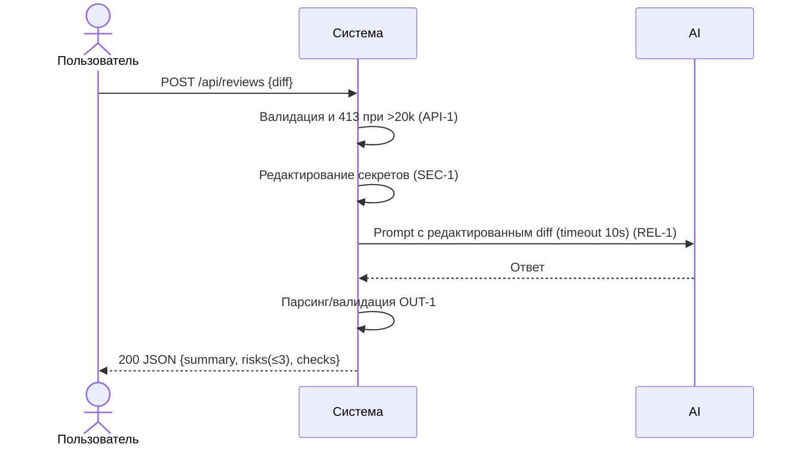

# Use cases и user stories

## Первый рабочий сценарий

**Когда** ревьюер или CI отправляет diff PR в сервис по эндпоинту `/api/reviews`, **система** валидирует и ограничивает вход, редактирует секреты, формирует структурированный результат по OUT-1 и возвращает его, **а пользователь получает** краткое резюме, до трёх подтверждённых рисков с evidence и список проверок.

Не входит в этот сценарий:

- аутентификация и авторизация;
- интеграция с GitHub (комментарии в PR);
- хранение результатов ревью;
- автоматическое approve/merge (запрещено SCOPE-1).

## Use case

| Поле | Значение |
|---|---|
| Актор | Ревьюер (человек) или CI‑пайплайн |
| Триггер | Появился diff PR, требуется первичная оценка рисков |
| Предусловия | Доступен HTTP‑эндпоинт `/api/reviews`; сформирован корректный diff |
| Основной результат | HTTP 200 с JSON по OUT‑1: `summary`, `risks` (≤3, file/line/evidence/risk), `checks` |
| Ошибка или отказ | HTTP 413 при diff > 20 000 символов (API‑1); контролируемый ответ при таймауте LLM (REL‑1); 4xx при невалидном теле (конкретный код — открытый вопрос) |



## User stories и acceptance criteria

```gherkin
Feature: Первичная проверка PR по diff

  Scenario: Позитивный ответ по контракту OUT-1
    Given доступен эндпоинт POST /api/reviews
    And корректный diff длиной <= 20000 символов
    When я отправляю запрос с полем diff
    Then я получаю 200 OK
    And тело ответа содержит поля summary, risks и checks
    And в risks не больше 3 элементов и каждый содержит file, line, evidence, risk

  Scenario: Негативный — слишком длинный diff
    Given доступен эндпоинт POST /api/reviews
    And diff длиной больше 20000 символов
    When я отправляю запрос
    Then я получаю 413 Payload Too Large

  Scenario: Граничный — секреты в diff не утекают
    Given сервис редактирует секреты по SEC-1
    And diff содержит строку token=abc123
    When вызывается внешний LLM
    Then в отправленном prompt значение секрета замещено маркером [REDACTED]
```

## Как использовали AI

- Для чего: сформулировать основной use case, отразить обязательные правила (SEC‑1, API‑1, OUT‑1, REL‑1, OBS‑1) и вывести приемочные критерии.
- Тип промпта: master prompt ревью диффа и сборка Context Pack.
- Строка в [`prompts.md`](prompts.md): P1-02 и «Master Prompt v1».
- Что проверили и исправили сами: убрали нефактические требования; добавили граничные сценарии, следуя CASE.md; связали сценарии с тестами.
