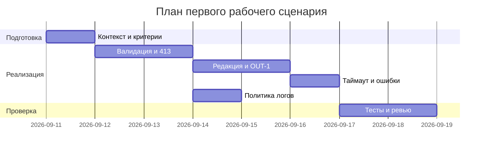

# План поставки

## Инкременты и ответственность

| Инкремент | Наблюдаемый результат | Что делает человек | Что делает AI или субагент | Проверка | Зависимости |
|---|---|---|---|---|---|
| 1 | Согласованный контракт OUT-1 и правила в Context Pack | Утверждает OUT-1, API-1, SEC-1 границы | Генерирует черновики формата и примеры | Просмотр peers, линк на CASE.md | CASE.md |
| 2 | Реализация валидации и 413 на уровне API | Ревью и приемка MR | Предлагает тест‑кейсы и фиксации | Интеграционный тест: длинный diff → 413 | Инкремент 1 |
| 3 | Редакция секретов и структурный ответ | Ревью и приемка MR | Подсказывает регулярки/фильтры, JSON‑схему | Юнит‑тесты редактирования; интеграционный тест контракта | Инкремент 1 |
| 4 | Таймаут LLM и контролируемый ответ | Ревью, настройка таймаута | Генерирует негативные тесты (таймаут) | Интеграционный тест: имитация таймаута → контролируемый ответ | Инкременты 2–3 |
| 5 | Политика логов OBS-1 | Ревью, аудит логов | Предлагает формат логов | Тест/перехват логов → нет diff/LLM‑ответа | Инкремент 2 |

## Диаграмма Ганта

Допущение: конкретные календарные даты ниже — учебные плейсхолдеры; фактические сроки не зафиксированы и требуют согласования.

Даты ориентировочные для учебного кейса; при переносе на проект скорректируйте зависимости.

## Как использовали AI

- Для чего: разложить поставку на минимальные инкременты, выровнять проверки и зависимости.
- Тип промпта: структурирование master prompt в план работ.
- Строка в [`prompts.md`](prompts.md): P1-02.
- Что проверили и исправили сами: исключили неупомянутые в кейсе элементы (аутентификация, SLA), добавили OBS‑1/REL‑1 как обязательные.
